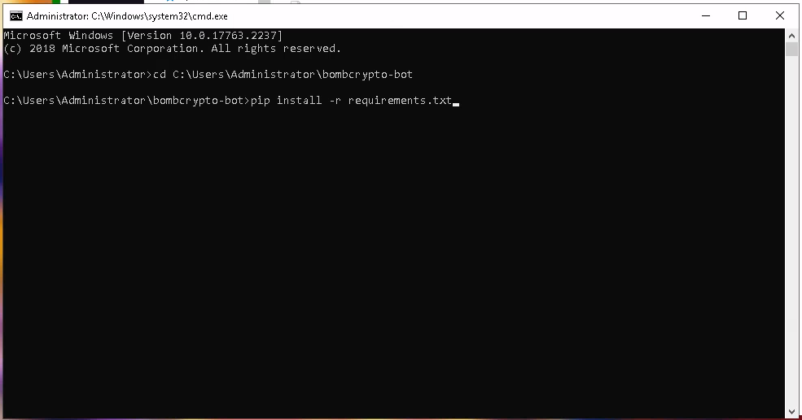

##Bot criado de forma rapida e sem a intenção de se aprofundar em codigo, apenas para execução rapida e pessoal

## Faz a boa pra nois

### Smart Chain Wallet(BUSD/BNB):

#### 0xB15bBa32C948C1d76a627E38E8a5068D24870d2c

# Instalação:

### Baixe e instale o Python pelo [site](https://www.python.org/downloads/) ou pela [windows store](https://www.microsoft.com/p/python-37/9nj46sx7x90p?activetab=pivot:overviewtab).

Se você baixar pelo site é importante marcar a opção para adicionar o
python ao PATH:


### Realize o download do codigo no formato zip, e extraia o arquivo.

### Copie o caminho até a pasta do bot:


### Abra o terminal.

Aperte a tecla do windows + r e digite "cmd":


### Navegue até a pasta do bot:

Digite o comando "cd" + caminho que você copiou:


### Instale as dependências:

```
pip install -r requirements.txt
```



### Vá até a pasta onde está o bot e renomeie o arquivo .env2 para .env:


### Abra o arquivo .env como txt, com cuidado para não acabar salvando o arquivo como txt, é importante manter o formato do mesmo:


### Caso o bot não esteja reconhecendo as imagens, você pode diminuir o valor de confidence para 0.8 ou 0.7, assim por diante:


### Pronto! Agora é só iniciar o bot com o comando

```
python3 index.py
```
